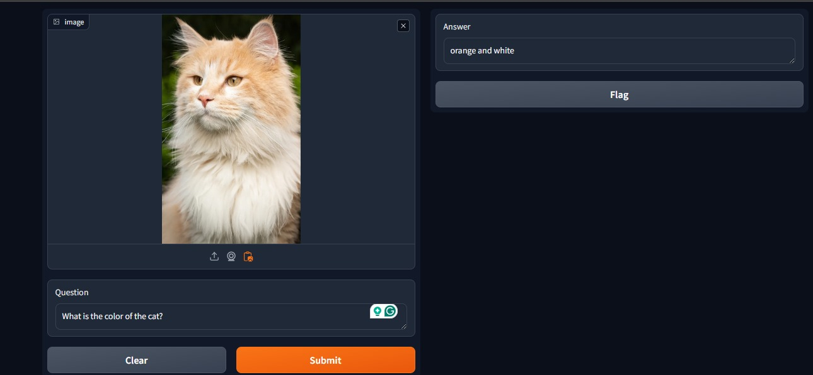

# Visual Question Answer

This project leverages **transformers** for question answering based on an uploaded image. The **user interface (UI)** is built using **Gradio**, providing an easy-to-use platform for interacting with the system.

### Key Features:
- Upload an image.
- Ask a question related to the uploaded image.
- The system processes the input and returns an accurate answer.

### How It Works:
1. Upload an image through the Gradio UI.
2. Type your question about the image.
3. The system analyzes both the image and the question, then provides an answer.


## Installation 

Clone repo and install required dependencies.

```

git clone https://github.com/arnabsroy9/Visual-Question-Answer.git
cd Visual-Question-Answer
pip install -r requirements.txt

```


### Your environmwnt is ready...

## Inference 

Open terminal in Visual-Question-Answer/app and execute: 
```
python main.py
```
## Output preview


